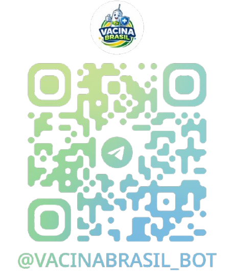

# Aprendizado por Projeto Integrado (API) - Assistente de Dados Públicos da Saúde para Vacinação💉

<p align="center">
  
</p>

Assistente virtual para Telegram que informa vacinas recomendadas com base na faixa etária, mostra cobertura vacinal por região/estado/cidade e localiza as UBSs mais próximas do usuário.

Projeto desenvolvido durante o **ano de 2026** por estudantes do curso de **Desenvolvimento de Sistemas da ETEC São José dos Campos**.

O projeto segue a metodologia ágil **Scrum**, com foco em desenvolvimento colaborativo e organização de tarefas.


## 📑 Índice

* [🎯 Objetivo do Projeto](#-objetivo-do-projeto)
* [👥 Equipe](#-equipe)
* [🎓 Orientadores](#-orientadores)
* [📋 Requisitos Não Funcionais](#-requisitos-não-funcionais)
* [🧰 Tecnologias Utilizadas](#-tecnologias-utilizadas)
* [🏗 Estrutura do Projeto](#-estrutura-do-projeto)
* [📌 Backlog do Produto](#-backlog-do-produto)
* [📊 Registro das Sprints](#-registro-das-sprints)
* [📖 Manual do Usuário](#-manual-do-usuário)
* [🛠️ Manual de Instalação](#manual-instalacao)

## 🎯 Objetivo do Projeto

Desenvolver um assistente virtual para Telegram que utilize dados de portais públicos oficiais de saúde sobre vacinação para informar o cidadão sobre:

* Calendário vacinal para diferentes faixas etárias (crianças, adolescentes, adultos e idosos);
* Consulta de vacinas recomendadas para gestantes;
* Cobertura vacinal por região, estado ou cidade;
* Localização das Unidades Básicas de Saúde (UBSs) mais próximas, via GPS ou CEP;
* Respostas a perguntas em linguagem natural por meio de um Assistente IA integrado.

Não deve haver persistência dos dados através de bancos de dados.

## 👥 Equipe

| Nome                   | Função        | LinkedIn & GitHub                                                                                              |
| :--------------------- | :-----------: | :-----------------------------------------------------------------------------------------------------------: |
| Davi de Paiva Cavalcanti de Lima | Scrum Master | []( ) []( ) |
|  Lucas Turibio Alves  | Product Owner | []( ) [](https://github.com/Turibi) |
|  Samuel da Costa Oliveira  |  Team Member / Dev  | []( ) [](https://github.com/samuelcoliveira1-ui) |

## 🎓 Orientadores

- Prof. Jean Carlos Lourenço Costa

## 📋 Requisitos Não Funcionais

* Linguagem de Programação Python;
* Repositório Git;
* Manual do Usuário;
* Gestão de Projetos de Software com Jira;
* Manual de Instalação.

## 🧰 Tecnologias Utilizadas

<h4 align="center">
  <a href="https://www.python.org/">
    
  </a>
  <a href="https://telegram.org/">
    
  </a>
  <a href="https://ollama.com/">
    
  </a>
  <a href="https://git-scm.com/">
    
  </a>
  <a href="https://github.com/">
    
  </a>
  <br>
  <a href="https://code.visualstudio.com/">
    
  </a>
  <a href="https://www.atlassian.com/software/jira">
    
  </a>
</h4>

## 🏗 Estrutura do Projeto

```
VacinaBrasil-Bot/
├── src/
│   ├── main.py                        — Inicializa os dados e inicia o polling do bot
│   ├── bot.py                         — Configuração do bot, menus, utilitários e controle de estado por usuário
│   ├── handlers.py                    — Handlers de mensagens, callbacks e comandos
│   ├── core/
│   │   └── engine.py                  — Consulta de calendários, busca de vacinas, cobertura vacinal e funcionamento da IA
│   ├── data_handler/
│   │   ├── scraping_calendario.py     — Scraping do calendário vacinal a partir dos PDFs do Ministério da Saúde
│   │   ├── scraping_cobertura.py      — Scraping dos dados de cobertura vacinal
│   │   ├── scraping_ubs.py            — Obtém e processa a base de dados das UBSs
│   │   ├── handler_ubs.py             — Localiza as UBSs mais próximase; converte CEP em coordenadas
│   │   └── loader.py                  — Carrega os arquivos JSON
│   ├── data/
│   │   └── processed/
│   │       ├── calendario_vacinas.json
│   │       ├── cobertura_vacinal.json
│   │       └── ubs.csv
│   └── utils/
│       └── helpers.py                 — URLs dos PDFs oficiais por grupo vacinal e outras funções auxiliares
├── assets/
│   ├── img/
│   │   ├── banner.jpg
└── requirements.txt
```

## 📌 Backlog do Produto

| Rank | Prioridade | User Story | Sprint |
| :--- | :---: | :--- | :---: |
| 1 | Alta | Como usuário, quero acessar o bot pelo Telegram para iniciar a consulta de informações sobre vacinação. | 1 |
| 2 | Alta | Como usuário, quero selecionar minha faixa etária para receber as vacinas recomendadas. | 1 |
| 3 | Alta | Como usuário, quero utilizar um menu interativo com botões para navegar pelas opções do sistema. | 1 |
| 4 | Alta | Como equipe de desenvolvimento, precisamos estruturar o repositório Git e organizar as tarefas no Jira para gerenciar o desenvolvimento do projeto. | 1 |
| 5 | Alta | Como usuário, quero consultar a cobertura vacinal por região para obter informações atualizadas. | 2 |
| 6 | Média | Como equipe de desenvolvimento, queremos melhorar a navegação pelo menu interativo com botões para tornar a experiência mais intuitiva. | 2 |
| 7 | Alta | Como equipe de desenvolvimento, queremos corrigir erros identificados durante a validação do sistema para garantir respostas corretas. | 2 |
| 8 | Baixa | Como usuário, quero visualizar um botão com mais informações sobre o assistente e sua equipe de desenvolvimento para entender a origem da ferramenta. | 3 |
| 9 | Baixa | Como usuário, quero um botão para visualizar e baixar os calendários vacinais originais (PDFs) para guardar ou imprimir. | 3 |
| 10 | Média | Como usuário, quero poder pesquisar a cobertura vacinal especificamente da minha cidade, estado ou macrorregião. | 3 |
| 11 | Alta | Como usuário, quero poder digitar perguntas de forma livre (ex: "quais vacinas pra idoso?") e ser compreendido pelo bot, sem precisar clicar em botões. | 3 |
| 12 | Alta | Como usuário, quero informar meu endereço ou enviar minha localização para que o bot mostre o posto de saúde mais próximo. | 3 |


## 📖 Manual do Usuário

### 1. Apresentação

O bot de vacinação (`@assistente-vacinas_bot`) é um assistente no Telegram que permite consultar rapidamente quais vacinas são recomendadas de acordo com a **faixa etária**, ver a **cobertura vacinal** por região, estado ou cidade, e localizar as **UBSs mais próximas** da sua localização.

A base de dados utilizada pelo bot é composta por arquivos JSON gerados a partir de calendários de vacinação disponibilizados como arquivos PDF pelo Ministério da Saúde em `https://www.gov.br/saude/pt-br/vacinacao/calendario`, além de dados de cobertura vacinal e do cadastro de UBSs do DATASUS.

---

### 2. Público-alvo e Dores Atendidas 👤🩺

#### Usuários atendidos

* **Responsáveis por crianças:** Pais ou responsáveis que desejam acompanhar as vacinas recomendadas para seus filhos.
* **Jovens e adultos:** Pessoas que querem verificar quais vacinas ou reforços são indicados para sua faixa etária.
* **Idosos:** Usuários que desejam consultar quais imunizações são recomendadas a partir dos 60 anos.
* **Gestantes:** Mulheres que precisam saber quais vacinas são indicadas durante a gestação.

#### Dores que o bot atende

* **Dificuldade de interpretação do calendário vacinal:** As tabelas oficiais possuem muitas informações. O bot simplifica e mostra apenas as vacinas relevantes para o usuário.
* **Acesso rápido à informação:** Em vez de navegar por páginas e documentos, o usuário pode consultar as vacinas diretamente no Telegram.
* **Consulta de cobertura vacinal:** O usuário consegue consultar, através da navegação por botões ou por nome, as coberturas vacinais de regiões, estados e municípios do Brasil.
* **Localização de postos de saúde:** O bot mostra as 3 UBSs mais próximas com base na localização GPS ou CEP informado.
* **Linguagem natural:** O Assistente IA permite enviar perguntas em texto livre, sem necessidade de clicar em botões.

---

### 3. Iniciando o Bot

1. Abra o **Telegram**
2. Procure pelo bot `@vacinabrasil_bot` ou leia o QR Code abaixo:

<p align="center">
  
</p>

3. Abra a conversa e digite `/start` ou envie uma mensagem qualquer

Após a execução dessa etapa, o bot iniciará a interação e exibirá as opções disponíveis.

---

### 4. Fluxo principal de uso

#### 4.1 Menu inicial

Após enviada a primeira mensagem, o bot responderá com a mensagem:

**Bem-vindo(a) ao Vacina Brasil Bot 💉🇧🇷
O que deseja consultar hoje?**

e exibirá as seguintes opções:

* `Calendário Vacinal 📅`
* `Cobertura 📊`
* `IA (experimental) 🤖`
* `Localizar 📍`
* `Procurar 🔎`
* `Saiba Mais ℹ️`

---

#### 4.2 Consulta por faixa etária/grupo

1. Clique em **`Calendário Vacinal 📅`**.
2. Será exibido um menu no qual o usuário deverá escolher entre uma faixa etária ou `Gestante 🤰`.
3. O bot exibirá as vacinas recomendadas para o grupo escolhido.
4. O usuário poderá, se desejar, clicar no botão `Ver ou Baixar PDF 📄` ao final da mensagem para acessar o PDF oficial do Ministério da Saúde.

Exemplo de resposta:

```
🗓️ 9 a 14 anos:

💉 HPV4
    • 1 dose (conforme histórico vacinal)

───────────────────

🗓️ 10 a 14 anos:

💉 dengue tetravalente
    • 2 doses (conforme histórico vacinal)

───────────────────

🗓️ 11 a 14 anos:

💉 meningite meningocócica ACWY
    • 1 dose

───────────────────

🗓️ 10 a 24 anos:

💉 hepatite B
    • 3 doses (conforme histórico vacinal)

💉 dT
    • 3 doses (conforme histórico vacinal)

💉 febre amarela
    • 1 dose (conforme histórico vacinal)

💉 tríplice viral SCR
    • 2 doses (conforme histórico vacinal)

💉 pneumocócica 23 – valente
    • 2 doses (somente indígena, sem histórico vacinal com pneumo conjugada)

💉 varicela
    • 2 doses (somente indígena e trabalhador de saúde, sem histórico da doença ou na dúvida e conforme histórico vacinal)
```

---

#### 4.3 Consulta de cobertura vacinal

1. Clique em **`Cobertura 📊`**.
2. Escolha entre **Região 🌎**, **Estado 🗺️** ou **Cidade 🏙️**.
3. Navegue até o local desejado e o bot exibirá a cobertura vacinal por vacina.

Exemplo de resposta:

```
📊 Cobertura vacinal - Região Sudeste

📈 Média das vacinas: 78.81%

💉 Vacinas:

• BCG: 79.5%
• DTP (1° Reforço): 73.13%
• Febre Amarela: 81.47%
• Hepatite A Infantil: 76.02%
• Hepatite B (< 30 Dias): 80.09%
• Hepatite B (<= 1 dia): 65.21%
• Hepatite B (<= 2 dias): 68.37%
• Meningo C: 83.87%
• Meningocócica Conjugada (1° Reforço): 83.18%
• Penta (DTP/HepB/Hib): 84.23%
• Pneumo 10: 83.47%
• Pneumo 10 (1° Reforço): 82.08%
• Polio Injetável (VIP): 84.9%
• Polio Injetável (VIP)(Reforço): 76.84%
• Rotavírus: 81.21%
• Tríplice Viral - 1° Dose: 85.91%
• Tríplice Viral - 2° Dose: 73.58%
• Varicela: 75.52%
```

---

#### 4.4 Assistente IA

1. Clique em **`IA (experimental) 🤖`**.
2. Digite sua pergunta em linguagem natural, por exemplo: *"cobertura vacinal sudeste"*.
3. O bot interpretará a pergunta e retornará a resposta adequada.

> **Requisito:** o Assistente IA utiliza o modelo **Qwen2.5** via **Ollama**, que deve estar instalado e em execução localmente (veja o Manual de Instalação).

---

#### 4.5 Localizar UBS próxima

1. Clique em **`Localizar 📍`**.
2. Envie sua localização pelo GPS (botão `📍 Enviar minha localização`) **ou** digite seu CEP (somente números).
3. O bot retornará as 3 UBSs mais próximas com endereço e link para o Google Maps.

Exemplo de resposta:

```
🏥 UBSs mais próximas:

🥇UBS JARDIM DAS INDUSTRIAS — mais próxima
    Rua Pirassununga, Jd Das Industrias, São José Dos Campos
    📍 Ver no Google Maps

🥈UBS PARQUE INDUSTRIAL
    Rua Goiania, Parque Industrial, São José Dos Campos
    📍 Ver no Google Maps

🥉UBS LIMOEIRO
    Rua Corifeu De Azevedo Marques, Limoeiro, São José Dos Campos
    📍 Ver no Google Maps
```

---

### 5. Observações

* O bot precisa estar **em execução** para responder às mensagens.
* Os dados de calendário e cobertura são atualizados automaticamente toda semana ao iniciar o bot.
* O Assistente IA (`IA (experimental) 🤖`) requer o Ollama com o modelo Qwen2.5 instalado localmente.
* O tempo de resposta pode levar alguns segundos enquanto o sistema processa os dados.

---

## 🛠️ Manual de Instalação <a id="manual-instalacao"></a>

### 1.1 Requisitos

Para executar o bot localmente é necessário:

* Conexão à Internet;
* [Python](https://www.python.org/downloads/) 3.9 ou superior instalado;
* [Git](https://git-scm.com/install/);
* Token de um bot criado no **BotFather** (@BotFather no Telegram);
* [Ollama](https://ollama.com/) instalado e em execução (necessário para o Assistente IA).

### 1.2 Instalação

Abra um terminal e clone o repositório:

```bash
git clone https://github.com/nexusdevapi/VacinaBrasil-Bot.git
cd VacinaBrasil-Bot
```

Instale as dependências:

```bash
python -m pip install -r requirements.txt
```

### 1.3 Configurando o Ollama (Assistente IA)

Instale o [Ollama](https://ollama.com/) e baixe o modelo Qwen2.5:

```bash
ollama pull qwen2.5
```

Mantenha o Ollama em execução em segundo plano antes de iniciar o bot.

### 1.4 Inserindo um Token

Abra o arquivo `src/bot.py` e substitua o valor da variável `TOKEN` pelo token gerado pelo BotFather:

```python
TOKEN = "SEU_TOKEN_AQUI"
```

`(Exemplo de Token: "8391826405:AAQxZr7KpLmN8sVtY2HdFJcW9uB3EgR5iKQ")`

### 1.5 Executando o Bot

Dentro do diretório clonado, execute:

```bash
python src/main.py
```

Agora é só iniciar uma conversa com o bot no Telegram e manter-se em dia!
